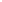
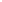

In [git bla(i)me](/blog/git-blame-intent-aware-agents/), I argued that if agents end up writing more of our code, maintainers will need better artifacts around that code.[^2]

Not only the diff, but also the context, reasoning, and evidence needed to understand a change later.

That was part of why I mentioned Entire there already.[^2] What stood out to me was the direction: treating agent sessions as part of the commit story, not as disposable context around it.

Their newer post on how the Entire CLI works did not change my view. It made that direction more concrete.[^1] It also makes the stakes clearer: attribution, transparency, and reviewability are not only workflow concerns, but increasingly questions of trust, compliance, and safety.[^1]

I do not think code review disappears any time soon. But if agents can produce more code, faster, reviewers need better ways to see what was asked, what happened in between, and whether the result matches the intent.[^1][^2]

## What intent traces make concrete

Git is very good at telling us what changed. It is much worse at telling us why it changed, what was asked, what alternatives were considered, what the agent did in between, and what part was still shaped by a human.[^1][^2]

That is the gap I was trying to describe in *git bla(i)me*, and it is also the gap Entire is clearly targeting.[^1][^2]

What I find compelling is not only that they capture this context, but that they try to do it without forcing people out of normal Git workflows.[^1]

That means handling rebases, amend, squash, cherry-pick, stash, multiple agents, subagents, interrupted work, and rewritten history.[^1] The Checkpoint link is stored separately from the commit hash so it can survive history changes, while the system now tracks sessions with explicit state rather than relying on a simpler hook-based model.[^1]

This matters because it is no longer just a concept. It is a concrete attempt to preserve intent and decision history inside workflows people already use.

## Entire in GitLab

To make that more tangible, I have been experimenting with Entire’s CLI together with GitLab, using GitLab’s GDK-in-a-box to create a local environment where I can explore what this could look like inside a merge request workflow.[^6]

This is my own prototype and demo work, not a documented first-party Entire GitLab integration.

What I wanted to test was simple: can we surface intent and attribution where maintainers already review changes?

So instead of only seeing a diff, imagine opening a merge request and seeing:

The prompt that led to the change & the steps the agent took to get there, including the Skills and tools used.

Attribution showing what was changed by the agent and what was changed by a human.

Below is a full walkthrough of this GitLab merge request prototype in motion.

<iframe width="100%" height="500" src="https://www.youtube.com/embed/8WGmT2nGFpo" title="Beyond the diff: Entire CLI with GitLab merge request prototype" frameborder="0" allow="accelerometer; autoplay; clipboard-write; encrypted-media; gyroscope; picture-in-picture; web-share" allowfullscreen></iframe>

That does not prove correctness, but it does make review more inspectable.

Instead of reconstructing the story from a diff alone, a maintainer can begin with more focused questions: was the task framed correctly, were the constraints clear, did the agent take a sensible path, and what still needs human verification?

That is the part I find interesting. Not replacing review, but giving maintainers better artifacts inside the review flow they already use.

## Why this matters

What matters most to me is not the tool by itself. It is what this kind of tooling could change, especially in OSS.

In [Navigating the AI Storm](/blog/navigating-the-ai-storm/), I wrote that maintainers are often the people at the helm in open source, and also the people who end up carrying the burden when understanding does not keep up with output.[^3]

That is where comprehension debt, cognitive debt, and intent debt become practical problems.[^4][^5] Somebody still has to understand what landed, what risk came with it, and whether it should be trusted later.

A lot now happens between the user and the agent. Prompts, iterations, tool calls, subagents, rewrites, and decisions all shape the outcome.[^1] If that layer stays invisible, we are adding a new kind of opacity to software development at the same time output is accelerating.

From that perspective, tooling like this is interesting because it may help close part of the gap between output and understanding. If the story behind a change is easier to inspect, reconstruct, and search later, maintainers get something better than guesswork when they inherit code they did not write.

That matters not only for review, but also for incident response, audits, and long-term maintainability.[^2]

The trace explains intent. Verification proves it.[^2]

A transcript alone is not enough. We also need evidence, checks, benchmarks, tests, and guardrails. We also need to avoid turning transparency into noise, or capturing more session detail than teams can realistically retain and review.

## From code review to intent review

One thing I found interesting in the Entire post is that they say this out loud: they want to move from code review toward intent review.[^1]

That language is close to what I have been circling around too, although I would phrase it more carefully. Intent review is an added review layer, not a substitute for reading risky code.

What changes is where review begins. Before reading the implementation in detail, a reviewer can first inspect the task, the constraints, the decisions made along the way, and the evidence supporting the result.

## Conclusion

What Entire’s newer post gave me was not a new idea, but a more concrete example of the direction I was already exploring.

The next question is not only whether we can capture this context. It is whether we can surface it in the right places, in the right way, with the right guardrails.

I also hope this space moves toward open specifications, not only product-specific workflows.[^7]

If agent traces become more portable and inspectable across tools, they could become useful not only for review, but also for observability, audits, and incident analysis.[^7]

That is why I am experimenting with this in GitLab.

Because if we can show the prompt, steps, attribution, and evidence where maintainers already review changes, we are not only preserving intent after the fact. We are making it usable inside the SDLC.

## References

[^1]: [The Entire CLI: How It Works & Where It’s Headed](https://entire.io/blog/the-entire-cli-how-it-works-and-where-its-headed)
[^2]: [git bla(i)me: intent-aware blame for AI-generated code](https://www.ronaldtebrake.nl/blog/git-blame-intent-aware-agents/)
[^3]: [Navigating the AI Storm](https://www.ronaldtebrake.nl/blog/navigating-the-ai-storm/)
[^4]: [Comprehension Debt - the hidden cost of AI generated code](https://addyosmani.com/blog/comprehension-debt/)
[^5]: [From Technical Debt to Cognitive and Intent Debt: Rethinking Software Health in the Age of AI](https://arxiv.org/abs/2603.22106)
[^6]: [Configure GDK-in-a-box](https://docs.gitlab.com/development/contributing/first_contribution/configure-dev-env-gdk-in-a-box/)
[^7]: [RFC: Native OpenTelemetry representation for Agent Trace](https://github.com/cursor/agent-trace/issues/6)