A while back, I wrote about [embracing AI in coding](/blog/embracing-ai-coding-starter-kit-drupal) and shared an idea for a Drupal starter kit that tightly integrates AI assistance into the development workflow. Since then, I have been pushing on a very specific problem that keeps coming up when using AI with Drupal.

Ask an AI assistant a seemingly simple Drupal question and you often get an answer that is almost right, but subtly wrong. A hook that no longer exists. An example that only applies to an older major version. Advice that ignores how Drupal actually structures its APIs today.

The root cause is usually not the model itself, but context. The AI does not know which Drupal version you are working with, and it does not have reliable access to the API documentation that matters for your project.

Over the last months I have been experimenting with a way to fix that. The result is a proof of concept that is starting to feel genuinely useful: a locally hosted MCP server that gives AI assistants intelligent, version-specific access to Drupal’s API documentation, directly from your development environment.

## Why This Started

At first glance it seems like modern AI tools should solve this problem automatically. Large language models are trained on vast amounts of public code and documentation, so it is reasonable to expect them to answer Drupal questions correctly.

In practice, that assumption breaks down for two related reasons.

First, AI models are trained on a mixture of Drupal versions. When you are working on a specific Drupal 10 or Drupal 11 project, the answers you get may be based on outdated or mixed information. Even small version differences can lead to incorrect suggestions.

Second, AI tools have limited visibility into Drupal’s core APIs at development time. In a typical Composer-based setup, much of Drupal’s API is just a dependency and the actual files are not part of your IDE indexes. That means the assistant often relies on its training data or web search, rather than the actual APIs available to your project.

The result is an assistant that knows a lot about Drupal in general, but too little about the exact version you are working with. What I wanted was a way to make the right API documentation for the right Drupal version available to AI tools, locally and directly, as part of the development workflow.

## How It Works: from Core Docs to Your IDE

```mermaid
flowchart TB
    subgraph Maintainer["🔧 Maintainer Workflow"]
        direction LR
        A1[Drupal Core<br/>*.api.php files] -->|Parse| A2[API Documentation]
        A2 -->|Generate Embeddings| A3[Ollama<br/>Embedding Model]
        A3 -->|Export| A4[JSON Files<br/>in Git]
    end
    
    subgraph EndUser["👤 End User Workflow"]
        direction TB
        B1[JSON Files<br/>from Git] -->|Hydrate| B2[Redis<br/>Vector Store]
        B3[IDE<br/>Cursor/Claude] -->|Query| B4[MCP Server]
        B4 -->|Generate Query Embedding| B5[Ollama<br/>Embedding Model]
        B5 -->|Query Vector| B4
        B4 -->|Vector Search| B2
        B2 -->|Results| B4
        B4 -->|Documentation| B3
    end
    
    Maintainer -->|Pre-computed| EndUser
    
    style A1 fill:#16A085,stroke:#138D75,stroke-width:2px,color:#fff
    style A2 fill:#5C6BC0,stroke:#3F51B5,stroke-width:2px,color:#fff
    style A3 fill:#F39C12,stroke:#D68910,stroke-width:2px,color:#fff
    style A4 fill:#FF9800,stroke:#F57C00,stroke-width:2px,color:#fff
    style B1 fill:#FF9800,stroke:#F57C00,stroke-width:2px,color:#fff
    style B2 fill:#E74C3C,stroke:#C0392B,stroke-width:2px,color:#fff
    style B3 fill:#4A90E2,stroke:#2E5C8A,stroke-width:2px,color:#fff
    style B4 fill:#9B59B6,stroke:#6C3483,stroke-width:2px,color:#fff
    style B5 fill:#F39C12,stroke:#D68910,stroke-width:2px,color:#fff
```

The key idea is simple: precompute documentation embeddings once per Drupal version, then let AI query them locally at runtime.

Behind the scenes, the workflow looks like this:

**Ingestion & Embedding (maintainers only)**

Drupal's core API files are parsed to extract documentation blocks. We generate vector embeddings with a local model (via Ollama) and export them as JSON in the repo.

**Hydration (end users)**

You load those embeddings into a Redis vector store. This makes semantic search fast and offline-friendly.

Your IDE (Cursor, Claude Desktop, etc.) sends a natural-language query to the MCP server.

The server:
- Detects your Drupal version from `composer.lock`
- Generates an embedding for the query
- Searches Redis for the most relevant documentation
- Returns structured results with matching API docs + examples

That means asking things like "What hook runs when an entity is saved?" returns real matches from the right Drupal version — not just generic text or guesswork.

## Key Components Under the Hood

Everything in this stack is locally hosted and open-source:

- [MCP PHP SDK](https://github.com/modelcontextprotocol/php-sdk) for the MCP

- PHP-Parser + DocBlock extraction for scraping API docs using [nikic/PHP-Parser](https://github.com/nikic/PHP-Parser)
- Redis with [redis-applied-ai/redis-vector-php](https://github.com/redis-applied-ai/redis-vector-php) for storage
- [Ollama](https://ollama.com/) for embedding generation (no API keys, local models)
- Docker & Docker-Compose to orchestrate Redis and Ollama easily
- And obviously with PHP and Symfony to tie it all together

Because it's local, you avoid sending code or docs to external services and can work fully offline.

## MCP Tools You Can Use Today

The server exposes several MCP tools that AI assistants can use:

| Tool | Purpose |
|------|---------|
| `drupal_search` | Semantic natural-language search |
| `drupal_lookup` | Lookup specific hook/class by name |
| `drupal_versions` | Show which Drupal versions are available |
| `drupal_set_version` | Override default version |
| `drupal_app_info` | Detect version from project |

Those tools give clients rich, structured access to the API docs — something no existing Drupal-AI integration currently offers.

## Example

Here’s a concrete example that highlights the problem and the impact of version-aware documentation.

In Drupal `11.2.x` [New hook_entity_duplicate() and hook_ENTITY_TYPE_duplicate() hooks](https://www.drupal.org/node/3268812) were introduced. When asking an AI assistant about entity duplication behavior, the correct answer depends entirely on whether those hooks exist in the current Drupal version.

*Drupal 10 - without MCP usage:*

The AI suggests the actual hooks that do not exist in Drupal 10. The answer sounds plausible, but it is based on newer APIs and therefore incorrect for this project.

*Drupal 10 With MCP:*

With MCP enabled, the AI has access to Drupal 10–specific API documentation. The response correctly avoids the new hooks and instead references APIs that actually exist in this version.

*Drupal 11 With MCP:*

In a Drupal 11 environment, the same question now produces a different, version-appropriate answer. The AI correctly references the newly introduced hooks, because MCP exposes the relevant documentation for Drupal 11.2.x.

## Where This Fits in the Drupal AI Landscape

This experiment reinforces an idea that keeps coming up when working with AI in real projects: better assistance is not all about better models or more elaborate prompts. Context matters more than most people expect.

By making Drupal’s API documentation version-aware, searchable, and locally accessible through MCP, AI tools can work with the same information an experienced Drupal developer would actively look up. That shifts AI from guessing based on training data to answering based on the actual platform and version you are using.

This approach could form the foundation of a Drupal AI starter kit that offers version-correct suggestions, safer refactoring, and scaffolding that follows Drupal conventions instead of fighting them.

There are already related efforts in the community, such as the [Drupal MCP module](https://www.drupal.org/project/mcp) module, and I think there is room to explore how something like Surge could evolve into a shared, possibly cloud-hosted MCP service for Drupal. But even in its current local-only form, this experiment already proves the value of version-aware documentation access.

If you are interested in where this could go next, [I would love to continue the conversation on Drupal.org](https://www.drupal.org/project/surge/issues/3563383#comment-16384867), or you can explore the code yourself in the surge-mcp-dev repository at [ronaldtebrake/surge-mcp-dev](https://github.com/ronaldtebrake/surge-mcp-dev/).