A while back, I wrote about [embracing AI in coding](/blog/embracing-ai-coding-starter-kit-drupal) and shared an idea about a starter kit for Drupal developers that tightly integrates AI assistance into the Drupal development workflow. Since then I've been experimenting with taking that idea further, specifically how to bring semantic search of Drupal's API documentation into your local development workflow.

Today I'm excited to share a proof of concept that's shaping into something nice: a locally hosted MCP server that gives AI assistants intelligent access to version-specific Drupal API docs.

## Why This Started

At first glance it looks like modern AI models and tools should make our work easier straight away. Large language models are trained on huge amounts of code and documentation from the public web, so it sounds like they should know everything we need. In reality this is not always true.

The first issue is that the training data of a model does not always match the version you are working with. You might be working on a Drupal 10 or Drupal 11 project, while the AI gives answers based on older or mixed information. This means the suggestions can be incorrect for your code base and may send you in the wrong direction.

The second issue is how AI tools see your project. Most tools can only index what is available in your local workspace. In a typical Drupal setup with Composer and Git, a lot of core API documentation is not part of the project files that your IDE indexes. Important functions, hooks, or documentation blocks are simply not visible. As a result the editor mainly relies on the model itself, and sometimes on web search, instead of real project context.

In short, the tools we use every day often do not fully understand the context we are working in. The model may know too much irrelevant information and not enough about the specific Drupal version that matters. The tool only knows what it can see locally, and very often it does not see enough. What I wanted was a way for AI to access the right Drupal documentation for the right version and to give answers that matter to my current project, right inside my editor.

## How It Works: from Core Docs to Your IDE

```mermaid
flowchart TB
    subgraph Maintainer["🔧 Maintainer Workflow"]
        direction LR
        A1[Drupal Core<br/>*.api.php files] -->|Parse| A2[API Documentation]
        A2 -->|Generate Embeddings| A3[Ollama<br/>Embedding Model]
        A3 -->|Export| A4[JSON Files<br/>in Git]
    end
    
    subgraph EndUser["👤 End User Workflow"]
        direction TB
        B1[JSON Files<br/>from Git] -->|Hydrate| B2[Redis<br/>Vector Store]
        B3[IDE<br/>Cursor/Claude] -->|Query| B4[MCP Server]
        B4 -->|Generate Query Embedding| B5[Ollama<br/>Embedding Model]
        B5 -->|Query Vector| B4
        B4 -->|Vector Search| B2
        B2 -->|Results| B4
        B4 -->|Documentation| B3
    end
    
    Maintainer -->|Pre-computed| EndUser
    
    style A1 fill:#16A085,stroke:#138D75,stroke-width:2px,color:#fff
    style A2 fill:#5C6BC0,stroke:#3F51B5,stroke-width:2px,color:#fff
    style A3 fill:#F39C12,stroke:#D68910,stroke-width:2px,color:#fff
    style A4 fill:#FF9800,stroke:#F57C00,stroke-width:2px,color:#fff
    style B1 fill:#FF9800,stroke:#F57C00,stroke-width:2px,color:#fff
    style B2 fill:#E74C3C,stroke:#C0392B,stroke-width:2px,color:#fff
    style B3 fill:#4A90E2,stroke:#2E5C8A,stroke-width:2px,color:#fff
    style B4 fill:#9B59B6,stroke:#6C3483,stroke-width:2px,color:#fff
    style B5 fill:#F39C12,stroke:#D68910,stroke-width:2px,color:#fff
```

Behind the scenes, the workflow looks like this:

**Ingestion & Embedding (maintainers only)**

Drupal's core API files are parsed to extract documentation blocks. We generate vector embeddings with a local model (via Ollama) and export them as JSON in the repo.

**Hydration (end users)**

You load those embeddings into a Redis vector store. This makes semantic search fast and offline-friendly.

Your IDE (Cursor, Claude Desktop, etc.) sends a natural-language query to the MCP server.

The server:
- Detects your Drupal version from `composer.lock`
- Generates an embedding for the query
- Searches Redis for the most relevant documentation
- Returns structured results with matching API docs + examples

That means asking things like "What hook runs when an entity is saved?" returns real matches from the right Drupal version — not just generic text or guesswork.

## Key Components Under the Hood

Everything in this stack is locally hosted and open-source:

- [MCP PHP SDK](https://github.com/modelcontextprotocol/php-sdk) for the MCP
- PHP-Parser + DocBlock extraction for scraping API docs using [nikic/PHP-Parser](https://github.com/nikic/PHP-Parser)
- Redis with [redis-applied-ai/redis-vector-php](https://github.com/redis-applied-ai/redis-vector-php) for storage
- [Ollama](https://ollama.com/) for embedding generation (no API keys, local models)
- Docker & Docker-Compose to orchestrate Redis and Ollama easily
- And obviously with PHP and Symfony to tie it all together

Because it's local, you avoid sending code or docs to external services and can work fully offline.

## MCP Tools You Can Use Today

The server exposes several MCP tools that AI assistants can use:

| Tool | Purpose |
|------|---------|
| `drupal_search` | Semantic natural-language search |
| `drupal_lookup` | Lookup specific hook/class by name |
| `drupal_versions` | Show which Drupal versions are available |
| `drupal_set_version` | Override default version |
| `drupal_app_info` | Detect version from project |

Those tools give clients rich, structured access to the API docs — something no existing Drupal-AI integration currently offers.

## Example

Here's a visual comparison showing how the MCP server improves AI assistance with Drupal API documentation for the specific use case where [New hook_entity_duplicate() and hook_ENTITY_TYPE_duplicate() hooks](https://www.drupal.org/node/3268812) were added in 11.2.x:

*Without MCP: Generic AI responses that may not match your Drupal version, tested in a Drupal 10 environment*

*With MCP: Version-specific, accurate API documentation for Drupal 10 environment*

*With MCP: Version-specific, accurate API documentation for Drupal 11*

## Where This Fits in the Drupal AI Landscape

With a local MCP server like this, the path toward a true Drupal AI coding starter kit becomes clearer. We now have a way to serve real context to AI tools, and that's the foundation for version-aware codex suggestions, refactoring assistants, and even AI-driven scaffolding that respects Drupal's standards.

There are other MCP-related efforts in the community — for example the [Drupal MCP module](https://www.drupal.org/project/mcp) so perhaps there are possibilities for Surge to become a cloud based MCP contributed to the community, without the need for all these tools to run it locally.

If you're curious, [I would love to hear your thoughts on Drupal.org](https://www.drupal.org/project/surge/issues/3563383#comment-16384867) or checkout the project at [ronaldtebrake/surge-mcp-dev](https://github.com/ronaldtebrake/surge-mcp-dev/)

