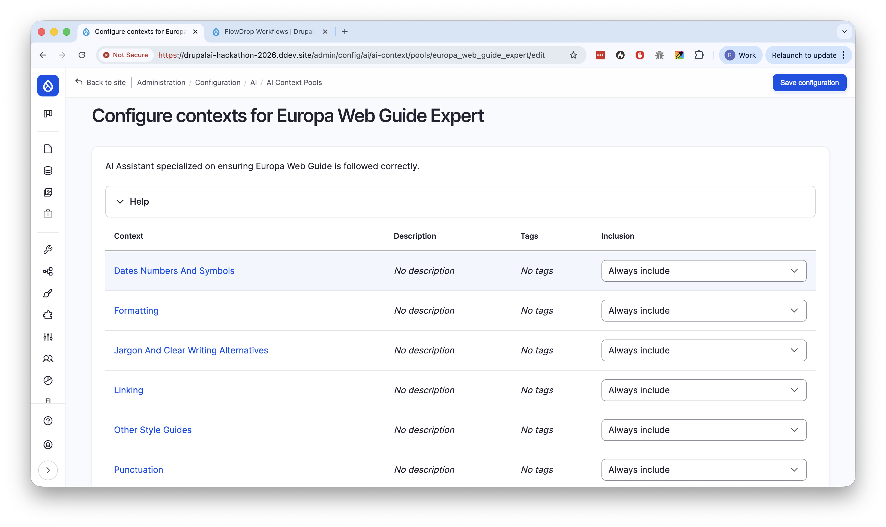
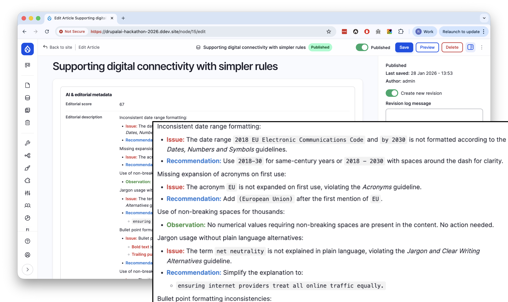
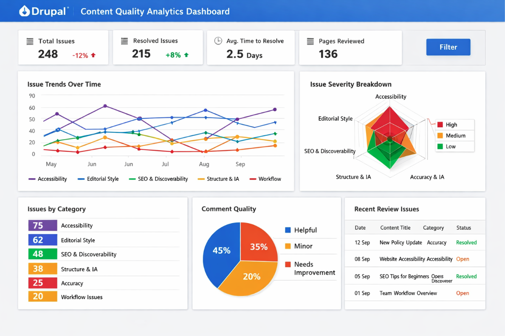

# A Hackathon Full of Energy, Ideas, and Real Problems

Last week, we took part in the Drupal AI Hackathon – Play to Impact: 2026 edition at the European Commission, and it was genuinely a great experience from start to finish. The event was very well organised, and one thing that stood out immediately was how thoughtfully the teams were composed. Each team had a healthy mix of business folks and developers, which turned out to be a perfect balance. Ideas moved fast, but they stayed grounded.

Our team chose to work on a challenge around a question that feels increasingly relevant: **how can AI better support content editors?**

## Starting With the Right Conversations

One of the highlights of the hackathon was how it kicked off. Instead of jumping straight into building, we had the chance to talk directly with content editors working within the European Commission. Those first hours turned into a kind of rapid discovery phase, and that made a huge difference.

We didn't have to guess what the real problems were. We could ask, test assumptions, and keep looping back with them as our ideas evolved. That direct feedback loop was incredibly valuable and reinforced something we already knew: when teams have easy access to real users, they naturally focus on solving real problems.

## Understanding the Reality of Content Workflows

Through those conversations, we learned a lot about how content actually flows through the organisation. Drafts move back and forth between authors and reviewers. There are multiple review rounds. Every piece of content needs to comply with a long list of guidelines and checks before it can be published.

None of that was surprising on its own, but seeing the full picture helped us spot a deeper pattern.

That led us to our core idea, which we summed up like this:

> **Every review comment should make the next piece of content better by default.**

## Reframing the Problem

A key insight for us was that **human review is not the problem**. Quite the opposite. Reviewers add context, catch subtle issues, and raise the overall quality of content.

The real issue is what happens *after* the review.

In most workflows, review feedback is treated as disposable. Once a piece of content is published, all that learning disappears. The same comments, corrections, and explanations have to be repeated again and again on future drafts.

So we shifted our focus. The real value lies in turning review feedback into structured knowledge, with the principle that **every review comment improves future content by design**.

## What We Built

During the hackathon, we built a prototype called **ACE** (Augmented Content Editor) — an AI-powered agent that scores content against configurable guidelines. Those guidelines are provided through AI context (using `drupal/ai_context`), which means the system can be adapted to different organisations, teams, and their rule sets.

<small>*Configuring AI contexts: Guidelines can be set up and managed per organisation or team, ensuring the AI assistant follows the right standards.*</small>

Using FlowDrop (`drupal/flowdrop`) we were able to tie the entire workflow together, from the entity being triggered to getting the contexts and have an LLM score it. This was done using Mistral's models, which was kindly sponsored by Mistral AI.

On a basic level this proof of concept already helps editors by giving concrete, actionable feedback on drafts.

<small>*The actual content being scored.*</small>

<small>*Editorial score and feedback: The AI provides a quantitative score and detailed, actionable recommendations based on the configured guidelines.*</small>

But it also opens the door to much more.

## What would be next?

As scores and comments are stored per revision, trends can be visualised, helping coordinators see where mentoring or clarification is needed for what specific guideline.

<small>*Trend visualization: Tracking scores over time helps identify patterns and areas where teams need additional support or training.*</small>

The entire content lifecycle, from draft to published, including all revisions and feedback can be captured in a knowledge graph, enabling historically grounded and referenced learnings which we can use as human driven context to help improve the quality for editors in the future.

<small>*Knowledge graph: By modeling content, revisions, feedback, and guidelines as interconnected nodes, we can capture relationships and enable AI to learn from historical patterns.*</small>

The real value isn't in improving a single revision. It's in capturing the *entire lifecycle* of content, including all the feedback, scoring and improvements that happen along the way.

## Looking Back

We obviously couldn't build everything we envisioned in the limited time we had. Still, the prototype gave us a solid proof of concept.

More than anything, the hackathon reinforced how powerful it is to combine direct user input, diverse teams, and a clear focus on real-world workflows. It was intense, fun, and genuinely inspiring. We'd happily do it again.

None of this would have been possible without exceptional organization and facilitation. Huge thanks to the Drupal Community of Practice organizing team, NTT DATA's Innovation team, the jury members, and sponsors including Drupal AI, amazee.ai, Mistral AI, and DevPanel and obviously the other attendees that made it a very inspiring event. 

## References

- Drupal AI Hackathon Play to Impact: 2026 edition  
  [https://drupal-community-of-practice.ec.europa.eu/drupal-ai-hackathon-play-impact-2026-edition_en](https://drupal-community-of-practice.ec.europa.eu/drupal-ai-hackathon-play-impact-2026-edition_en)

- Drupal AI Context module  
  [https://www.drupal.org/project/ai_context](https://www.drupal.org/project/ai_context)

- FlowDrop module  
  [https://www.drupal.org/project/flowdrop](https://www.drupal.org/project/flowdrop)

- Mistral AI  
  [https://mistral.ai](https://mistral.ai)

- Neo4j AI Systems  
  [https://neo4j.com/use-cases/ai-systems/](https://neo4j.com/use-cases/ai-systems/)
