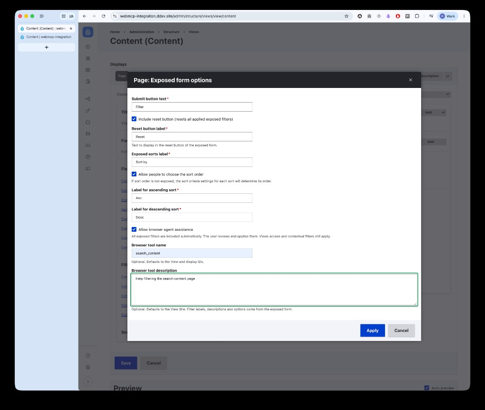
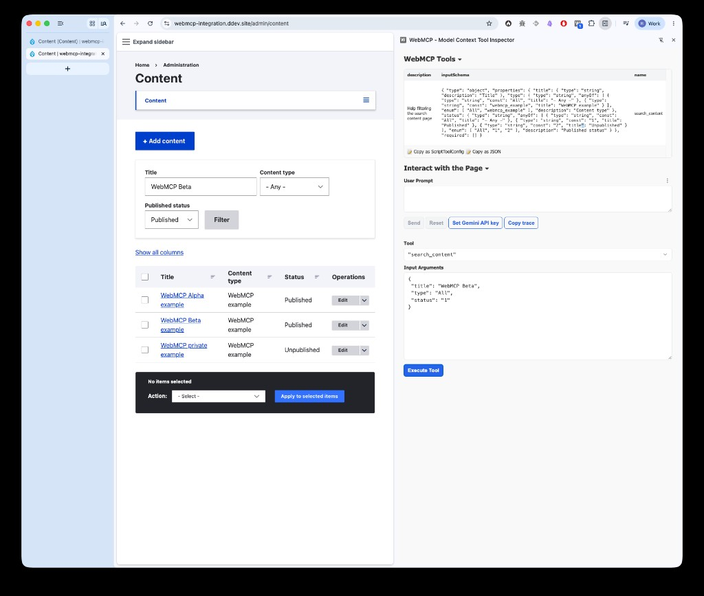

I started reading about WebMCP because I wanted to understand how it relates to the MCP work already happening in Drupal.

We already have MCP Server, Tool API, and the bridge between those two.

So my first question was:

> Where does WebMCP fit in that picture?

I built a proof of concept in [WebMCP Integration](https://www.drupal.org/project/webmcp_integration) to explore that question.

One important note first: WebMCP is still early. The current specification is a W3C Community Group Report, not a W3C Standard or Standards Track specification, and browser implementations are still experimental.

So this is very much an experiment.

In order to test it, I am using:
- Google Chrome with the flag WebMCP for testing enabled, at [chrome://flags/#enable-webmcp-testing](chrome://flags/#enable-webmcp-testing)
- [A Chrome Extension to let web developers inspect web pages to verify if WebMCP tools are correctly exposed, visualize the input schema, and debug connection issues directly within the browser.
](https://github.com/beaufortfrancois/model-context-tool-inspector)

## What is WebMCP?

WebMCP lets a web page expose structured capabilities to an AI agent running in the browser.

Instead of an agent only looking at a page, scraping it and trying to understand which button or field does what, the page can explain some of those actions directly.

There are currently two ways to do that imperative and declarative.

With the imperative API, a page registers tools through JavaScript. The page defines what a tool does, what input it expects and what should happen when an agent calls it.

Declarative WebMCP takes a different approach. Existing HTML forms can be enhanced with additional attributes so the browser can expose the form itself as a tool.

The imperative API gives developers more control. The declarative approach is closer to progressively enhancing what already exists.

For example, an agent could call an imperative tool like this:

```
{
  "tool": "createAppointment",
  "arguments": {
    "name": "Ronald",
    "email": "ronald@thisisanexample.com",
    "message": "Can we sit seaside?",
    "phone": "+31612345678",
    "date": "2026-09-06"
  }
}
```

The page can register that tool through JavaScript:

```javascript
document.modelContext.registerTool({
  name: 'createAppointment',
  description: 'Create an appointment.',
  inputSchema: {
    type: 'object',
    properties: {
      name: {
        type: 'string',
        description: 'Your Name',
      },
      email: {
        type: 'string',
        description: 'Your Email',
      },
      message: {
        type: 'string',
        description: 'Message',
      },
      phone: {
        type: 'string',
        description: '0612345678',
      },
      date: {
        type: 'string',
        format: 'date',
        description: "Date (Dates MUST be provided in 'YYYY-MM-DD' format.)",
      },
    },
    required: ['name', 'email', 'message', 'date'],
  },
  execute: async (input) => {
    // ...
  },
});
```

The declarative approach is the one that immediately made me think about Drupal.

But before getting into that, if agents can already use websites by looking at the page, clicking buttons and filling in forms, why do we need WebMCP at all?

## Agents can already use browsers

Agents are getting better at using browsers and computers directly.

They can inspect a page, click buttons, enter values, scroll and continue through a workflow.

But it is rarely a single clean step. That is where WebMCP starts to make more sense.

### Tools vs scraping

[Sarah Drasner's WebMCP demo](https://webmcp-demo-sdras.netlify.app/#compare) captures the difference better than any diagram I could draw. The same booking widget, two ways for an agent to work with it: scrape the DOM on the left, call structured tools on the right.

On the left, the agent parses dozens of DOM nodes and guesses meaning from `aria-*` attributes and class names. On the right, the page declares three typed tools and the agent calls them directly.

<div class="not-prose blog-embed-wide my-10">
<iframe width="100%" height="720" src="https://webmcp-demo-sdras.netlify.app/#compare" title="WebMCP side-by-side demo by Sarah Drasner" loading="lazy" style="border: 0; border-radius: 1rem; min-height: 720px;"></iframe>
</div>

<p><em>Interactive demo by <a href="https://webmcp-demo-sdras.netlify.app/">Sarah Drasner</a>. Press <strong>Run agent</strong> on each side to watch an AI try to book a slot — once by scraping, once by calling tools.</em></p>

Browser use can spend a lot of context on all that DOM navigation. Whether WebMCP reduces that meaningfully is still something I want to test.

## Adding declarative WebMCP to Drupal forms

The declarative WebMCP proposal is about enhancing normal HTML forms so the browser can expose them as tools.

A form can get attributes such as `toolname` and `tooldescription`, while the existing form controls provide the inputs. The browser can then build a structured tool from the form. Without automatic submission, native execution fills the form and waits, giving the user an opportunity to review and submit it. ([WebMCP declarative API](https://github.com/webmachinelearning/webmcp/blob/main/declarative-api-explainer.md))

Drupal's Form API already has much of the structure WebMCP needs: titles, descriptions, required fields, values and other metadata. It builds that structure first and only later renders it to HTML.

So the experiment is quite simple:

> Can we use what Drupal already knows about a form to make sure the right WebMCP attributes end up in the rendered HTML?

That maps quite nicely to Drupal.

But I do not think every Drupal form should suddenly become available to an agent.

The proof of concept has a form enhancer that can add the declarative WebMCP information to an existing Drupal form. A developer can opt a form in and provide the information WebMCP needs, without changing how that form normally works.

But modules like Views and Webform let site builders create these interactions through their own UI. Could they opt a form into WebMCP without touching code?

## Trying it with Views

Views felt like a good first place to try this.

Site builders already use Views to create lists and search pages, including the exposed filters visitors can interact with. That makes those exposed forms a natural place to let a site builder opt into WebMCP.



On the content overview View, I enable browser agent assistance in the exposed form options. The site builder sets a tool name and description — `search_content` and "Help filtering the search content page" in this case — without touching WebMCP attributes or JavaScript.



On the same page, the [Model Context Tool Inspector](https://github.com/beaufortfrancois/model-context-tool-inspector) extension shows the structured tool the browser picked up: the filter fields, their types, and the current values. That is enough to verify the integration works before handing it to an agent.

### Webform: trying the same task with and without WebMCP

Views was a useful first test, but I also wanted something a bit more involved.

So I used Webform, with help from AI, to build a pizza reservation form with enough fields, options and validation to resemble a small real-world form rather than a minimal demo. I also enabled automatic submission.

The reservation asks for a date and time, number of people, pizza preference, contact details and an additional message. That gives the agent enough interface to work through to make a comparison useful.

I ran the same task twice: once with WebMCP and once without it.

In both runs the agent received exactly the same reservation task and used the same model, browser, viewport and starting state. The only meaningful difference was that WebMCP was available in one run and disabled in the other.

Both agents completed the reservation correctly.

With WebMCP enabled, the browser exposed the form as a structured tool. The agent discovered the form, filled all of the values and submitted it through one WebMCP tool call. It then checked the confirmation page.

Without WebMCP, the agent had to work through the interface itself. It looked at screenshots, clicked fields, entered the values and submitted the form using normal mouse and keyboard controls.

<div class="not-prose blog-embed-wide my-10">
<iframe width="100%" height="720" src="https://www.youtube.com/embed/kLbjdkl4DEY" title="WebMCP vs browser control on the same Drupal Webform" loading="lazy" style="border: 0; border-radius: 1rem; min-height: 720px;" allow="accelerometer; autoplay; clipboard-write; encrypted-media; gyroscope; picture-in-picture; web-share" allowfullscreen></iframe>
</div>

<p><em>Recording of both runs on the same pizza reservation Webform, with WebMCP enabled and disabled.</em></p>

| Metric                 | With WebMCP | Without WebMCP | Difference     |
| ---------------------- | ----------: | -------------: | -------------- |
| Correct values saved   |         8/8 |            8/8 | Same result    |
| Successfully submitted |         Yes |            Yes | Same result    |
| Tool calls             |           3 |              6 | 50% fewer      |
| Elapsed time           |      20.9 s |         50.1 s | 58% less       |
| Total input tokens     |      46,006 |        100,176 | 54% fewer      |
| ↳ Cached input         |      20,736 |         71,936 | Included above |
| ↳ Uncached input       |      25,270 |         28,240 | 11% fewer      |
| Output tokens          |         221 |            739 | 70% fewer      |

Both agents submitted the reservation successfully, and I verified all eight stored values in Drupal. The difference was in how they got there.

With WebMCP, the agent needed half the number of tool calls, processed 54% less input across the run, and finished in less than half the time.

The token numbers need a bit of context though.

Most of the extra input in the normal browser run was cached input. The agent kept processing earlier context while looking at the page and deciding what to do next. If we only look at uncached input, the difference is much smaller: about 11%.

So I would not read this as "WebMCP made the task 54% cheaper."

What it does show in this run is that the agent needed less back and forth with the interface. It could use the structured form directly instead of repeatedly looking at the page, deciding what to click, and carrying that interaction forward through the next model calls.

The normal browser run also had to correct the date once. I left that recovery in the recording and in the measurements.

This is still a comparison. It is a useful illustration of what WebMCP could offer, but not a benchmark. There is too much model and runtime variability to draw broad conclusions from it.

## So where do MCP Server and Tool API fit?

So far I have mostly looked at declarative WebMCP, where existing forms become easier for an agent to understand and use. That fits naturally with Views and Webform because the agent is still working through the same interface as the user.

MCP Server comes from a different direction. An external MCP client does not need the Drupal interface at all.

Tool API may connect those two models. It already defines reusable Drupal operations, and MCP Server Tool Bridge can expose them to external MCP clients. That is conceptually close to imperative WebMCP, where a page registers explicit tools through `document.modelContext.registerTool()`. ([Chrome WebMCP imperative API](https://developer.chrome.com/docs/ai/webmcp/imperative-api))

A Tool API operation could therefore potentially be exposed through both paths: through MCP Server for an external client, and through imperative WebMCP for an agent working in the current browser page.

Declarative WebMCP fits the forms and interfaces Drupal already renders. Imperative WebMCP might fit operations that already exist through Tool API.

## Where this leaves me

The current demo is enough for me to think there is something worth exploring here.

Declarative WebMCP maps surprisingly well to the way Drupal already builds forms, and Views and Webform make that more interesting because site builders already control much of that structure.

I still do not know how far this goes once we get into more complex Drupal interfaces.

The next thing I want to explore is Tool API. I want to prove with code whether the same Drupal operation can be exposed through both MCP Server and WebMCP before overpromising.

I also want to try some UI-heavy examples and build better evaluations around them.

Calendar could be interesting because it has more state and interaction. Commerce also seems like a natural fit, and I am curious about more visual interfaces such as Canvas.

How much of that interface does an agent actually need, and how much can we expose as structured capabilities instead?

As the specification evolves, I will keep testing.

## References

* [WebMCP side-by-side demo](https://webmcp-demo-sdras.netlify.app/#compare) by Sarah Drasner
* [WebMCP vs browser control on a Drupal Webform](https://youtu.be/kLbjdkl4DEY)
* [Drupal Demo - WebMCP Integration](https://www.drupal.org/project/webmcp_integration)
* [WebMCP specification](https://webmachinelearning.github.io/webmcp/)
* [WebMCP declarative API explainer](https://github.com/webmachinelearning/webmcp/blob/main/declarative-api-explainer.md)
* [WebMCP on Chrome for Developers](https://developer.chrome.com/blog/webmcp-epp)
* [Model Context Tool Inspector](https://github.com/beaufortfrancois/model-context-tool-inspector)
* [MCP Server](https://www.drupal.org/project/mcp_server)
* [MCP Server Tool Bridge](https://www.drupal.org/project/mcp_server_tool_bridge)
* [Tool API](https://www.drupal.org/project/tool)
